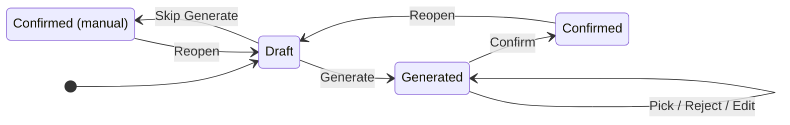
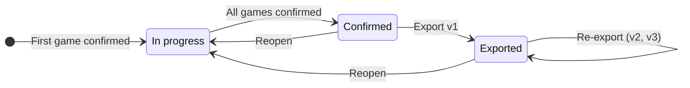

# PJ202-weekly-report-automation – Functional Spec (seed)

Status: seed only. Content moved out of the PRD (rev 13) so the PRD stays short. Nothing here is final; it becomes the base of the Functional Spec once the PRD is approved.

PRD: https://docs.google.com/document/d/1KqcC3HIZPI7yOE2itAmX2kWBKbKMtrxtigF5Aqzj1GU

To be added when writing the spec: screens and fields, R-SL4 exact numbers, G3 "light edit" threshold, R-AI9 confidence criteria, G6 idle threshold (X minutes), NFRs (Generate time, export time), the export feasibility and sample-audit results.

---

## 1. Game and batch lifecycle

Status is tracked per game first; the batch can be confirmed only when every game is confirmed.

### 1.1 Game lifecycle

| From | To | Trigger |
|---|---|---|
| (start) | Draft | Game enters the report |
| Draft | Generated | Generate (needs a video) |
| Generated | Generated | Choose / Reject / edit / Generate again |
| Generated | Confirmed | Confirm (all required fields filled) |
| Draft | Confirmed (manual) | Skip Generate (all required fields filled; video optional) |
| Confirmed / Confirmed (manual) | Draft | Reopen the game |

|  | Normal confirm | Skip Generate |
|---|---|---|
| Condition | Generated; each suggestion chosen, or rejected and filled by hand | Never generated |
| Video | Required | Optional; inserted later in Slides |
| Required fields | R-CF1 / R-CF2 | R-CF1 / R-CF2 |
| Status | Confirmed | Confirmed (manual) |
| Counts toward G2 / G3 | Yes | No |

### 1.2 Batch lifecycle

| From | To | Trigger |
|---|---|---|
| (start) | In progress | First game in the batch has its recording confirmed |
| In progress | Confirmed | All games confirmed and blocking flags handled |
| Confirmed | Exported | Export v1 (no blocking flags) |
| Exported | Exported | Export again after data changes (v2, v3…) |
| Confirmed / Exported | In progress | Reopen the batch or a game |

- **Report creation:** automatic when the batch's first game has its recording confirmed (from the pilot batch onward); earlier batches are created by hand (R-DA10). Reports cannot be deleted.
- **Batch confirmation:** every game is Confirmed or Confirmed (manual), and every "removed from Record" / "moved to another batch" flag is handled (keep or remove). Warning flags (missing video, changed video, private video, missing data, AI cost cap exceeded) do not block.
- **After batch confirmation:** changes in Record only raise blocking flags; the batch keeps its status (R-DA7).
- **Export / export again:** per R-EX3.
- **Reopen:** reopening a game or the batch returns the batch to In progress and re-applies R-DA6; exported files keep their links.

---

## 2. Business rules

### 2.1 Data and game collection (R-DA)

| Code | Rule |
|---|---|
| R-DA1 | A game enters the report when its recording is confirmed and it has a 5' or 20' bucket in the batch's Record (set automatically from the final conclusion: Insight → 5', Priority IV → 20'; or added / changed by the Lead). Bucket none is excluded. A game whose recording has just been confirmed enters the draft automatically. Each game appears once per report. |
| R-DA2 | Pre-filled from the database: name, icon, store link, publisher, release date, store description (game_info); 5' video for Insight, 20' video for Top Pick (ytb_uploads); evaluator notes, initial and final (game_evaluations). |
| R-DA3 | Missing fields (usually a video link uploaded but not yet synced) are filled by hand and flagged; manual data is stored only in the report. Exception: a manually entered release date is written to game_info when the game has a record there (a later store sync overwrites it); without a record it stays in the report. |
| R-DA4 | The PIC note is entered by the Report Owner in each game's draft; optional. |
| R-DA5 | A missing video is flagged and its link can be entered by hand; without a video, Generate is disabled. If the video changes in the sheet after use, the site switches to the new link and flags "video changed". |
| R-DA6 | Before batch confirmation and after a reopen: new games enter the draft automatically; a game whose bucket changes moves to the other section and keeps its data, and a confirmed game returns to Draft; a game removed from Record stays with a flag and must be handled before the batch is confirmed. |
| R-DA7 | After batch confirmation or export: changes in Record (new, removed, re-bucketed or moved games) only raise blocking flags; the batch keeps its status. Blocking flags lock Export / Export again until the batch is reopened, the flags are handled and the batch is confirmed again. |
| R-DA8 | When the Lead moves a game to another batch, its data moves with it to the new report; the old report keeps a read-only snapshot taken at the time of the move, flagged "moved to another batch" (keep or remove). |
| R-DA9 | Games outside Record cannot be added by hand, and reports cannot be deleted. Only games flagged removed / moved can be removed from a report. |
| R-DA10 | Reports are created automatically for batches from the pilot onward. For an earlier batch, the Report Owner creates the report by hand from the report list; games are collected per R-DA1, and every other rule then applies as for any batch. |

### 2.2 Confirmation (R-CF)

| Code | Rule |
|---|---|
| R-CF1 | Insight required fields: title, icon, store link, publisher; and at least one of game-alike / Mech / Genre / Theme, with at most one value per type. Optional: release date, 5' video. |
| R-CF2 | Top Pick required fields: title, icon, store link, release date, core gameplay; a component breakdown of 1–3 sections, each with a game ref (title, store link, icon) and the shared parts, except a Feature section which needs no game ref; or NEW GAMEPLAY. Optional: tags, 20' video. |
| R-CF3 | Normal confirm: the game was generated, has a video and all required fields. Status Confirmed. |
| R-CF4 | Skip Generate: only for a game that was never generated (no video yet, or the Report Owner prefers to fill it by hand). All required fields must be filled; only the video may be missing (inserted later in Slides). Status Confirmed (manual); it counts as confirmed for batch confirmation. |
| R-CF5 | Reopening a confirmed game returns the batch to In progress. |
| R-CF6 | After Generate, for each suggestion group (game-alike, Mech, Genre, Theme, core gameplay, breakdown), the Report Owner picks a suggestion, or presses Reject and fills the field by hand or leaves it empty (if optional). Rejects are recorded for the metrics (PRD section 5). |

### 2.3 AI (R-AI)

| Code | Rule |
|---|---|
| R-AI1 | Generate (Insight) runs only on click and only when a 5' video exists. Input: 5' video, store description, tag list, Game library. Output: up to 3 suggestions for each of game-alike / Mech / Genre / Theme, ranked by confidence level (R-AI9); 2–3 sentences of reasoning (stored as data, not shown on the slide). AI may return fewer than 3, or none for a type, when there is no plausible candidate, but should prefer returning a Low candidate over leaving a type empty; across the four types there is always at least one suggestion. |
| R-AI2 | Generate (Top Pick) runs only on click and only when a 20' video exists (from the sheet or entered by hand). Input: 20' video, store description, evaluator notes (initial and final), PIC note, tag list, Game library. Output: 4–5 sentences of core gameplay following R-SL5; a component breakdown with game refs (an AI agent searches the library); up to 3 suggestions for each of Mech / Genre / Theme; a confidence level on every suggestion (R-AI9); 2–3 sentences of reasoning (stored as data). |
| R-AI3 | Each Generate creates a new version and never overwrites. The site keeps every version; the Report Owner chooses one and edits it. |
| R-AI4 | First pilot: the Top Pick prompt returns an empty breakdown / game ref so the Report Owner fills them in; it is switched on once the library has enough data. Manually entered breakdowns and game refs are still added to the library (R-LB3). |
| R-AI5 | Top Pick tags are chosen from the Generate suggestions; they are stored as data for the library and not shown on the slide. |
| R-AI6 | On an AI error or timeout: show the error with a retry button; the Report Owner can still fill fields by hand or use Skip Generate. |
| R-AI7 | Each batch has an AI cost cap (amount approved by the Sponsor after M2), set by the developer in configuration, with no UI. When the cap is exceeded, the site warns and logs, and AI still runs. |
| R-AI8 | All AI output is in English. The site stores the original output of every Generate together with the Report Owner's actions (chosen, rejected, edited) for metrics, audit, and tuning the library and prompts. The model is chosen after the research and the M2 go / no-go. |
| R-AI9 | Every suggestion carries a confidence level shown in the UI: **High** – clearly seen in the video and matching the library; **Medium** – partial match, or based on the description only; **Low** – little evidence, for reference only. Detailed criteria are set in the Functional Spec and calibrated on choose / reject data. |

### 2.4 Tag list (R-TG)

| Code | Rule |
|---|---|
| R-TG1 | The Mech / Genre / Theme list is seeded from past report slides. Tags, component values and Game library labels share this list. |
| R-TG2 | New values (from AI or typed freely) are pending; they join the list when a game using them is confirmed. |
| R-TG3 | Case-insensitive; when a typed value is close to an existing one, the site suggests the existing value. |
| R-TG4 | Management screen: rename, merge, hide; values in use cannot be hard-deleted. Changes apply to reports not yet exported; exported files stay unchanged. |

### 2.5 Game library (R-LB)

| Code | Rule |
|---|---|
| R-LB1 | One shared Game library, built before the pilot from: Game Alike in Weekly Feedback, game alike / final notes in evaluations, game refs in past reports, and games in game_info. AI reads and analyses the video and description (description and store screenshots when there is no video) to label each game (theme, game board, control, mechanic, genre…) and the relations between games; an agent then verifies each label and relation. |
| R-LB2 | There is no manual right / wrong review step. Quality comes from agent verification, the M2 test set (graded by NhiLV) and prompt engineering. On the site, the Report Owner picks one of up to 3 suggestions or fills in their own. |
| R-LB3 | Results the Report Owner confirms (game-alike, tags, breakdown / game ref, including manual entries) are analysed by an agent before they are added to the library. |
| R-LB4 | Rejected results are logged (R-AI8); the agent uses them to tune the library and prompts over time, with no fixed threshold. |
| R-LB5 | Relations are stored as a labelled graph: each edge = (child game → source game, aspect, value, origin, confidence); aspects are overall-like, mechanic, control, game board, theme, feature. Example: A uses C for mechanic and B uses C for control, giving two different edges into C. |
| R-LB6 | AI search uses the graph to rank suggestions: it collapses to a source only within the same aspect (B is like A and C is like B, both on mechanic → C's mechanic source is A); the source is the game released first; existing edges are never overwritten; the top 3 may include both the nearest game and the source game. A tree view on the site is a next step. |
| R-LB7 | The library needs a strong enough database: enough video / description / screenshots for the games to be labelled; storage for labels, edges, origin, confidence and agent results. Data coverage is checked in the sample audit; the database design is set in the Technical Spec. |

### 2.6 Slides (R-SL)

| Code | Rule |
|---|---|
| R-SL1 | The deck follows the Master Template with 4 slide types: Cover, Insight, Top Picks list, Top Pick detail. Games are ordered by their latest confirmation time. |
| R-SL2 | Cover: "April 2026 – W1 Report", generated from the batch label. |
| R-SL3 | Insight: 8 cards per slide; more than 8 adds a slide with the same layout. A card has the icon, the name (hyperlinked to the store), "Gameplay" (hyperlinked to the 5' video; omitted when there is no video), the chosen chips ("[game-alike] - Like", Mech, Genre, Theme; only chips with a value are shown) and the line "[game] released by [publisher]". |
| R-SL4 | The Top Picks list always fits on one slide: up to 18 games keep the original layout; 19–27 add a column with icons and text at about 75%; 28–36 at about 60%; above 36 the site warns and still fits them in. Exact numbers are set in the Functional Spec. |
| R-SL5 | Top Pick detail, one slide per game: icon and name (hyperlinked to the store), release date at the top right, embedded 20' video (left empty when there is no video, inserted by hand later), 4–5 core gameplay bullets (control action; how objects react; how the queue affects play; game over; level complete), and the component breakdown: each section shows the game ref's icon and name (hyperlinked to the store) and the shared parts; a Feature section has no game ref; or NEW GAMEPLAY. |
| R-SL6 | A section with no games keeps its slide with the line "No game this week". |
| R-SL7 | A private or non-embeddable video: warn before export; the slide shows a link instead of the embedded video. |
| R-SL8 | Empty optional fields are left off the slide; "N/A" is never shown. |

### 2.7 Export (R-EX)

| Code | Rule |
|---|---|
| R-EX1 | Each export creates a new Google Slides file from the Master Template in the Draft Drive folder (already shared with the team), through HungDT's service account. Feasibility (creating from the template, embedding video, hyperlinks, shrinking the list) is tested early, during research or before the Functional Spec, so it does not block later work. |
| R-EX2 | The file name follows the sample report, e.g. "Apr 2026 W1 report"; later versions add " (v2)", " (v3)"… |
| R-EX3 | Export (including the first one) is enabled only when the batch is Confirmed and there is no unconfirmed game or blocking flag raised after confirmation; otherwise the batch must be reopened, the issues handled and the batch confirmed again. Export again also requires the data to have changed since the last export. The site warns that manual edits in the previous file do not carry over. |
| R-EX4 | If an export fails midway, the partial file is deleted, the error is shown and no version is counted. |
| R-EX5 | Every exported version keeps its link on the site. After export, small edits (such as inserting a video) are made by hand in Slides. |

---

## 3. Edge cases (QA test cases)

| # | Case | Site behaviour | Rule |
|---|---|---|---|
| E1 | Recording confirmed but the video has not synced | Enters the draft, flagged missing video, Generate disabled; enter the link by hand or use Skip Generate | R-DA1, R-DA5 |
| E2 | Top Pick has no 20' video | Generate disabled; enter the 20' link, or Skip Generate once the required fields are filled | R-AI2, R-CF4 |
| E3 | Game still has no video at confirmation | Normal confirm not possible; Skip Generate if the required fields are filled; the slide omits the Gameplay link / leaves the video area empty | R-CF4, R-SL3, R-SL5 |
| E4 | Video re-uploaded after Generate | New link used automatically, flagged "video changed" | R-DA5 |
| E5 | Private video | Warning before export; the slide shows a link instead of the embedded video | R-SL7 |
| E6 | Game not in game_info, or missing icon / publisher / description | Filled by hand, flagged, stored only in the report | R-DA3 |
| E7 | Top Pick has no release date | Must be entered by hand before confirming; written to game_info when a record exists, otherwise stored in the report | R-DA3, R-CF2 |
| E8 | Lead changes the bucket 5' ↔ 20' before batch confirmation | Moves section, keeps data; a confirmed game returns to Draft | R-DA6 |
| E9 | Lead removes a game from Record before batch confirmation | Kept with a flag; must be kept or removed before the batch can be confirmed | R-DA6 |
| E10 | A game's recording is confirmed after the batch is confirmed (before or after export) | Batch stays Confirmed with a blocking flag; Export / Export again locked until reopen, the new game is done and the batch is confirmed again | R-DA7, R-EX3 |
| E11 | Game removed or re-bucketed after confirmation / export | Blocking flag; Export again locked until reopened and handled | R-DA7, R-EX3 |
| E12 | Lead moves a game from W1 to W2 | Data moves with the game to W2; W1 keeps a read-only snapshot flagged "moved to another batch" | R-DA8 |
| E13 | Two people edit the same game | The later saver is warned and chooses overwrite or reload | PRD section 2 |
| E14 | A game is reopened after the batch is confirmed / exported | Batch returns to In progress, rules re-applied; exported files keep their links | R-CF5, R-DA6 |
| E15 | Generate again after editing the draft by hand | New version created next to the edited one; the edited version stays until another is chosen | R-AI3 |
| E16 | AI error / timeout | Error shown, retry; fill by hand or Skip Generate | R-AI6 |
| E17 | Batch AI cost cap exceeded | Warning and log; AI still runs | R-AI7 |
| E18 | Insight has no suitable game-alike | Left empty; can be confirmed if at least one other chip exists | R-CF1 |
| E19 | Insight has only one chip (e.g. Theme only) | Can be confirmed; the card shows only that chip | R-CF1, R-SL3 |
| E20 | Top Pick has no game ref | Choose NEW GAMEPLAY, or use a Feature section | R-CF2 |
| E21 | Game ref / game-alike not in the database | Enter name and link by hand (plus icon for a game ref) | US3, US4 |
| E22 | Pilot: Top Pick Generate returns an empty breakdown / game ref | Report Owner fills them in; results still go into the library | R-AI4, R-LB3 |
| E23 | Generated, but the suggestions are unusable | Reject each group and fill by hand; normal confirm; counted as a miss per PRD section 5 | R-CF6 |
| E24 | Typing the tag "Colour sort" when "Color Sort" exists | The existing value is suggested | R-TG3 |
| E25 | New tag, but the game is removed before confirmation | Value stays pending and does not join the list | R-TG2 |
| E26 | Batch has more than 8 Insight games | Extra Insight slide added | R-SL3 |
| E27 | Batch has more than 18 Top Picks | Still one list slide, shrunk in steps | R-SL4 |
| E28 | Batch has no Insight or no Top Pick | Slide kept with "No game this week" | R-SL6 |
| E29 | Export again clicked when nothing changed | Button disabled with the reason shown | R-EX3 |
| E30 | Slides API error / quota exhausted midway | Partial file deleted, error shown, no version counted | R-EX4 |
| E31 | A report is needed for a batch before the pilot | Report Owner creates it by hand; games collected per R-DA1 | R-DA10 |
