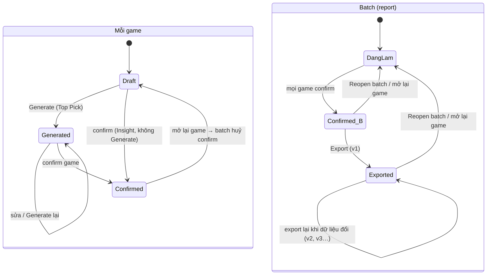

# PJ202-weekly-report-automation — Handoff context (29/09/2026)

File này để mở phiên Claude mới có đủ context làm tiếp. Đính kèm file này vào chat mới và nói đang làm tới đâu.

---

## 1. Dự án là gì

Tính năng **Weekly Report** trên site Signal Playtest (https://signal-playtest-management.replit.app/, Next.js + Neon DB dùng chung Signal Sense + n8n): site tự gom game của batch từ tab Record, điền sẵn dữ liệu, AI đề xuất game-alike/tag và viết nháp core gameplay, người làm review + confirm từng game rồi confirm batch, export ra Google Slides theo Master Template vào folder Draft Drive (service account Google Cloud của HungDT).

**Vai trò (đã chốt, hay nhầm):** MinhLQ giữ quyền PM (phê duyệt). HungDT là dev, quyết kỹ thuật, "in charge". NhiLV đóng góp nghiệp vụ, review, chấm kết quả AI — **KHÔNG phải Admin, không phải PM**. NhiLV + MyTL là Report Owner của quy trình tay hiện tại. VinhTD chấp nhận pilot. Sponsor duyệt chi phí AI.

**Chuỗi tài liệu đã thống nhất:** Charter (xong) → **PRD (đang làm, gần xong)** → Functional Spec → Technical Spec → Final Spec (đóng băng sau go/no-go M2).

**Cách làm việc user muốn:**
- Hỏi nhiều trước khi viết, đưa options kèm đề xuất cho từng câu (dùng multiple-choice).
- Draft tiếng Việt review trước → bản tiếng Anh đẩy lên Drive folder `1zk8BH252wn5pg7Vyg4HybvOSCV5M3s4o`.
- Không đánh số phase, gọi là "next step". Không nhắc số task nội bộ nếu chưa define.
- Giữ đúng mức chi tiết từng tài liệu (charter macro, PRD business, số liệu cụ thể để Functional Spec).

## 2. Tài liệu & link

| Tài liệu | Link | Trạng thái |
| --- | --- | --- |
| Charter v0.4 (EN, final, "đã chốt") | https://docs.google.com/document/d/1jUUeMQ6BnlUGCCneY2e9Bad9GXDUrscm-ibMzOe56AE | Xong. User đã tự chèn 2 hình diagram |
| Notes: Requirements & Process Notes (VI, decision log D1–D43) | https://claude.ai/code/artifact/05d14dc3-91da-4a02-81e8-3858c6f6b6f5 | Claude Doc của account cũ — **account khác có thể không mở được**, nội dung chính đã chép ở mục 5 dưới |
| PRD draft (VI) | https://claude.ai/code/artifact/1ad7f613-4c3b-4ff6-81c8-9598fe26d4de | Claude Doc của account cũ — **toàn văn chép ở mục 6 dưới** |
| Master Template | https://docs.google.com/presentation/d/1hY8RWjEnjrAmZ7WEJgZLqq-vj9CZYPatNwFXhhtrAWo | Insight 8 card/slide, Top Picks list 18 slot |
| Report mẫu Apr 2026 W1 | https://docs.google.com/presentation/d/1eNrCaVmu1inqiONeWuus0AKjynfy96DS3F40C4Af2co | 10 Insight, 21 Top Picks |
| Charter v0.2 / v0.3 (bản cũ trên Drive) | 1-oRYDxQL3LMPIiLVDrS1N3u1w_L4D1IZGtT2P2u_-fM / 1aePcr6EzLlTf2xOlvWplfSRunMqPkEfGZcuzs4-hUqY | Chỉ tham khảo |

Charter v0.4 tóm tắt: mục tiêu G1–G6 (G2 ≥80% gợi ý game-alike/tag giữ nguyên; G3 ≥80% nháp giữ với sửa nhẹ; G6 giảm ≥50% thời gian so với ~1h/game), timeline 60 ngày M0(2)–M1(7 PRD+tech spec)–M2(13 AI research + go/no-go 80% từng phần AI + Sponsor duyệt chi phí)–M3(11 draft/tag list/game-alike library/Suggest)–M4(11 game ref + component UI + Generate)–M5(9 confirm + export)–M6(7 pilot). Approval: charter & PRD & tech spec NhiLV → MinhLQ; go/no-go M2 HungDT + NhiLV → MinhLQ; pilot NhiLV → VinhTD. Rủi ro dev bị rút → giãn deadline.

## 3. Trạng thái hiện tại (29/09/2026)

- PRD draft tiếng Việt **đã viết xong 9 mục** (toàn văn ở mục 6), đã qua một vòng self-review.
- Vòng review tìm ra các điểm A1–A3 (mâu thuẫn logic), B1–B5 (case thiếu rule), C1–C3 (nhỏ) — đã ghi thành bảng options trong PRD mục 9, **user chưa chọn hướng**.
- 3 câu hỏi mở trong PRD mục 9 (G2 tính top1 hay top3; ngày release trống lúc export hiện gì; con số trần chi phí AI).
- Format PRD đã đối chiếu chuẩn: đủ mục; còn cân nhắc thêm 2–3 dòng non-functional và quyết định wireframe để Functional Spec.
- Đã thống nhất: **không audit toàn bộ data trước khi chốt PRD**; chốt A/B/C → đóng PRD → audit mẫu 4 mục (xem 4.2) trước Functional Spec; audit đầy đủ nằm trong M2.

### Việc tiếp theo (theo thứ tự)
1. User chọn hướng cho A1–A3, B1–B5, C1–C3 (bảng ở PRD mục 9) → vá vào PRD, trả lời nốt 3 câu hỏi mở.
2. Đóng PRD tiếng Việt → dịch sang tiếng Anh, đẩy lên Drive folder `1zk8BH252wn5pg7Vyg4HybvOSCV5M3s4o` để NhiLV review → MinhLQ duyệt.
3. Audit mẫu 4 mục (4.2) → sửa PRD nếu vỡ giả định.
4. Functional Spec (màn hình, field, con số của R-SL4 / R-LB4 / ngưỡng "sửa nhẹ" G3, wireframe).
5. Sync lại Notes cũ theo PRD (C3: bỏ "Admin (NhiLV)", manager = admin) — nếu account mới không mở được Notes, chỉ cần đảm bảo PRD là nguồn chuẩn.

## 4. Kết quả review & kế hoạch audit

### 4.1 Các điểm chờ user chốt (mỗi điểm có hướng đề xuất)
- **A1** Batch Confirmed chứa game mới (Draft) vào sau confirm; lúc đó Export lại mở ra → deck gồm game chưa confirm? Đề xuất: game vào sau confirm không tính điều kiện confirm; export chỉ gồm game đã Confirmed. (Hoặc: chặn export lại khi còn cờ; hoặc: game mới làm batch tự huỷ confirm.)
- **A2** Reopen batch: cờ tích tụ xử lý tự động hay tay? Đề xuất: Reopen áp lại rule như trước confirm (game mới tự vào draft, đổi bucket tự chuyển section, game bị bỏ phải xử lý).
- **A3** Game chuyển batch W1→W2, W1 chọn Giữ lại: một bản ghi chung hay hai? Đề xuất: W1 giữ snapshot chỉ-đọc tại thời điểm chuyển.
- **B1** Slide Insight thiếu game-alike / video 5': đề xuất bỏ hẳn dòng "- Like" / bỏ hyperlink Gameplay (ghi vào R-SL3).
- **B2** Đề xuất (Insight) khi chưa có video 5': đề xuất vẫn chạy bằng description + screenshot (như D42), gắn cờ.
- **B3** Extract tag lúc confirm lỗi: đề xuất chạy nền, không chặn confirm, thử lại được.
- **B4** Ngày release điền tay khi game không có record game_info: đề xuất chỉ lưu trong report (ngoại lệ ghi DB chỉ khi có record).
- **B5** Duyệt cặp game-alike khi dựng library: đề xuất bước offline 1 lần qua sheet (không làm màn site).
- **C1** G6 đo tới lần confirm đầu tiên (tránh phồng khi reopen).
- **C2** Trần chi phí AI: dev đặt qua config, không UI.
- **C3** Sync Notes theo PRD.

### 4.2 Audit mẫu trước Functional Spec (nửa ngày – 1 ngày)
| Kiểm tra | Nuôi quyết định |
| --- | --- |
| Cột store description trong game_info.metadata có thật/đủ không (query 1 lần) | R-DA2, input AI |
| Số Insight / Top Pick mỗi tuần trên ~8–12 report cũ (mẫu W1 Apr: 10/21) | R-SL3, R-SL4 nấc thu nhỏ |
| Tỉ lệ thiếu icon/publisher/ngày release/video tại thời điểm làm report (2–3 batch) | Độ ưu tiên luồng điền tay R-DA3/DA5 |
| Số cặp game-alike gom được từ 3 nguồn | B5: duyệt offline (trăm cặp) hay cần màn site (nghìn cặp) |

Audit đầy đủ (gom toàn bộ report cũ làm bộ test AI, seed tag list, dựng library) thuộc M2 — D43 đã chốt bộ test là toàn bộ report cũ, NhiLV duyệt kết quả.

## 5. Decision log D1–D43 (từ Notes, đã chốt 25/09/2026)

D1 Output: chỉ Google Slides, không PPTX. D2 Chỉ Weekly; Monthly là next step. D3 Game của kỳ lấy từ Record: Priority IV / Insight + game Lead thêm tay (không List_Idea). D4 Deadline không cố định. D5 Không chia game; (đã sửa theo PRD: manager = admin, không vai trò riêng; NhiLV + MyTL là Report Owner quy trình tay). D6 Confirm từng game → mới confirm batch. D7 AI viết nháp core gameplay, Admin sửa; Generate từng game, không Generate all. D8 Input AI: video + store description + note evaluator + note PIC + game ref/game-alike đã chọn. D9 Game ref search trong DB, icon/link tự sync, không có thì điền tay; trên slide là hyperlink. D10 Tag game-alike/Mech/Genre/Theme: AI đề xuất từ video YouTube, người làm review. D11 Ngày trên slide Top Pick = ngày release. D12 Component breakdown tham chiếu game ref; Feature là section riêng; tối đa 3 section kể cả Feature. D13 Site hết việc sau confirm batch + export; VinhTD review, sắp xếp slide ngoài scope. D14 Rule tràn slide define trong PRD (đã define: xem R-SL3/SL4). D15 Next step: library game gốc, AI search trên library, tagging tự động, import Affine, hierarchical, Monthly. D16 AI chỉ chạy khi bấm nút. D17 File export vào folder Draft Drive qua service account HungDT. D18 Video Top Pick nhúng trực tiếp; Insight là hyperlink "Gameplay". D19 Insight không cần core gameplay. D20 Sửa sau export làm tay trên Slides. D21 Tag list khởi tạo từ slide cũ, giá trị mới tự cập nhật. D22 Người confirm dự phòng: ngoài scope. D23 Game vào draft ngay khi có trong Record, không chờ video. D24 1 report = 1 batch, gộp mọi category. D25 Section theo bucket: 5'→Insight, 20'→Top Pick. D26 Lấy mọi game trong Record kể cả chưa confirm recording. D27 Game bị bỏ khỏi Record: giữ trong draft + cờ, người làm quyết. D28 Library game-alike từ data cũ: AI so video/description. D29 Game đổi bucket: tự chuyển section, giữ dữ liệu. D30 Report tạo tự động khi batch có game đầu tiên trong Record. D31 Mỗi game duy nhất trong report; 1 genre bucket. D32 Tag Top Pick extract một lượt từ nháp, chỉ lưu data, không lên slide (đã tinh chỉnh: extract lúc confirm, trên bản cuối). D33 Giá trị component chọn từ tag list hoặc nhập tự do. D34 Output AI tiếng Anh. D35 Model AI chọn sau research. D36 Thứ tự game theo thứ tự confirm. D37 Tên file theo report mẫu ("Apr 2026 W1 report"). D38 Thiếu video 5': cảnh báo, điền link tay. D39 Generate/export lại được, mỗi lần bản mới, không ghi đè. D40 Cấp manager + admin vào menu Weekly Report. D41 Nguồn game-alike cũ: Weekly Feedback, evaluation, report cũ. D42 Game gốc không video: so bằng description + screenshot store. D43 Bộ test AI = toàn bộ report cũ, NhiLV duyệt.

**Bảng liên quan trong DB:** `game_evaluations` (batch, category_group, final_conclusion, record_bucket 5min/20min/none/NULL=auto, record_confirmed_at, record_5min_assignee, record_20min_assignee), `game_info` (title, icon_url, app_link, initial_release, publisher_id, metadata), `ytb_uploads` (mirror sheet), `playtest_tags` (tag Trends), `weekly_feedback` (game_alike JSON). Filter tab Record: `record_bucket IN ('5min','20min') OR (record_bucket IS NULL AND final_conclusion IN ('Insight','Priority IV'))`.

## 6. PRD draft toàn văn (VI, rev 11)

# PJ202-weekly-report-automation – PRD (VI)

PRD mô tả tính năng Weekly Report trên Signal Playtest: site tự gom dữ liệu, AI hỗ trợ viết nội dung, người làm review, confirm rồi export ra Google Slides.

## 1. Tổng quan

**Vấn đề.** Weekly Report hiện làm tay trên Google Slides, khoảng 1 giờ mỗi game: gom game từ Record, copy icon / link / video, viết core gameplay, gắn tag, tìm game ref. Dữ liệu nằm rải rác trên slide nên không dùng lại được cho các bước sau (tagging, library game gốc, Monthly Report).

**Giải pháp.** Một màn Weekly Report trên Signal Playtest: site tự tạo report cho mỗi batch từ tab Record, điền sẵn dữ liệu có trong DB, AI đề xuất game-alike / tag và viết nháp core gameplay, người làm review và confirm từng game, rồi export ra Google Slides theo Master Template.

**Mục tiêu.** Theo G1–G6 của charter v0.4. Chỉ số đo cụ thể ở mục 7.

**Phạm vi PRD này.**
- Chỉ Weekly Report, 1 report = 1 batch, gộp mọi category (Puzzle / Arcade / Simulation).
- Hai section: Insight (game bucket 5') và Top Pick (game bucket 20').
- Output duy nhất là Google Slides, tạo trong folder Draft Drive qua service account của HungDT.
- Site hết việc sau khi export; review của VinhTD và sắp xếp slide là việc làm tay.
- Áp dụng từ batch pilot trở đi; không tạo report cho các batch cũ.

**Thuật ngữ.**

| Thuật ngữ | Nghĩa |
| --- | --- |
| Batch | Một kỳ playtest, vd. "W1 Apr, 2026" |
| Record | Tab Record trên trang YouTube của site: danh sách game cần quay video của batch |
| Bucket | 5' (→ Insight), 20' (→ Top Pick) hoặc none (không vào report) |
| Game-alike | Game có sẵn giống game đang report, hiển trên card Insight dạng "<game> - Like" |
| Game ref | Game được tham chiếu trong component breakdown của Top Pick |
| Component breakdown | Công thức "Game này = Section 1 + Section 2 (+ Section 3)", tối đa 3 section kể cả Feature |
| Danh sách tag | Danh sách giá trị Mech / Genre / Theme dùng chung cho tag và component |
| Library game-alike | Tập cặp (game, game-alike) đã xác nhận, AI dùng để đề xuất |
| Người làm | Người dùng cấp manager / admin đang làm report (xem mục 2) |

## 2. Người dùng & quyền

Menu Weekly Report nằm trong Playtest mgt, mở cho cấp **manager** và **admin**, hai cấp có quyền như nhau. Không có vai trò riêng trên site: ai được giao việc thì làm; có quyền truy cập không có nghĩa là phải làm.

| Người | Vai trò trong quy trình | Trên site |
| --- | --- | --- |
| NhiLV, MyTL | Report Owner của quy trình làm tay hiện tại; dự kiến NhiLV là người làm chính | Manager / admin |
| Lead | Thêm game vào Record hoặc đổi bucket (nguồn đầu vào của report) | Tab Record hiện có |
| VinhTD | Review deck sau export, chấp nhận pilot | Không cần thao tác trên màn này |

Mọi người có quyền đều làm được mọi thao tác: sửa, bấm Đề xuất / Generate, confirm game, confirm batch, reopen, export, quản lý danh sách tag và duyệt cặp game-alike.

**Sửa đồng thời.** Người lưu sau thắng. Khi lưu mà dữ liệu đã bị người khác sửa sau lúc mở, site cảnh báo và cho chọn ghi đè hoặc tải lại.

**Log.** Site ghi log mức hành động: ai, lúc nào, làm gì (sửa, Đề xuất, Generate, chọn bản, confirm, reopen, export, xử lý cờ). Không lưu diff từng trường.

## 3. Vòng đời game và batch

Trạng thái tính cho từng game trước; batch chỉ confirm được khi mọi game đã confirm. Game Insight không cần Generate nên đi thẳng từ Draft sang Confirmed.

[Sơ đồ trạng thái — mermaid tương đương:]

**Report được tạo** tự động khi batch có game đầu tiên trong Record (từ batch pilot trở đi). Không xoá được report.

**Confirm batch** cần đủ hai điều kiện:
1. Mọi game trong report đã Confirmed.
2. Mọi game có cờ "bị bỏ khỏi Record" hoặc "đã chuyển batch" đã được xử lý (giữ lại hoặc xoá khỏi report).

Các cờ khác (thiếu video, video private, thiếu dữ liệu, vượt trần chi phí AI) chỉ cảnh báo, không chặn.

**Quay lại trạng thái Đang làm** khi người làm mở lại một game đã confirm, hoặc bấm Reopen batch. Các file đã export vẫn giữ link trên site.

**Export lại** chỉ mở khi dữ liệu đã thay đổi sau lần export trước (xem R-EX3).

## 4. User stories & acceptance criteria

Mọi story dưới đây là của người làm (manager / admin). Mã R-xx trỏ tới business rule ở mục 5.

**US1 – Xem danh sách report.** Để biết batch nào đang làm tới đâu.
- Mỗi dòng là một batch, mới nhất trên cùng: nhãn batch, trạng thái (Đang làm / Confirmed / Exported), số game đã confirm / tổng, số cờ đang mở.
- Report đã export hiển link mọi bản (v1, v2…), bản mới nhất trước, kèm ngày giờ và người export.
- Không có deadline, không nhắc việc.

**US2 – Xem chi tiết report của một batch.** Để thấy việc còn lại.
- Hai danh sách Insight và Top Pick, mỗi game hiển trạng thái và cờ.
- Nút Confirm batch chỉ bật khi đủ điều kiện ở mục 3; nút bị tắt thì hiển lý do (vd. "còn 2 game chưa confirm").
- Nút Export chỉ bật khi batch Confirmed; nút Export lại theo R-EX3.

**US3 – Làm một game Insight.** Để có card Insight mà không phải tìm tay.
- Thấy dữ liệu điền sẵn (R-DA2) và video 5'; trường thiếu thì điền tay được (R-DA3).
- Bấm Đề xuất → AI trả top 3 game-alike và gợi ý Mech / Genre / Theme (R-AI1).
- Chọn đúng 1 game-alike (từ gợi ý hoặc search DB, không có trong DB thì điền tay tên + link) và 1 giá trị cho mỗi loại tag.
- Confirm được khi đủ R-CF1.

**US4 – Làm một game Top Pick.** Để có slide detail với core gameplay và component breakdown.
- Thấy dữ liệu điền sẵn và video 20'; thiếu video thì điền tay link 20' được.
- Chọn game ref cho từng section bằng search DB hoặc điền tay. Pilot đầu chưa có AI gợi ý game ref (R-AI4).
- Điền component breakdown (tối đa 3 section) hoặc chọn NEW GAMEPLAY; điền note của PIC nếu có.
- Bấm Generate → AI viết 4–5 câu core gameplay. Nút tắt khi chưa có video 20' (R-AI2).
- Generate lại tạo bản mới cạnh bản hiện tại; người làm chọn "Dùng bản này" rồi sửa tay.
- Confirm được khi đủ R-CF2. Khi confirm, AI extract Mech / Genre / Theme từ bản cuối; người làm xem và sửa được, không bắt buộc.

**US5 – Xử lý cờ.** Để report khớp với Record.
- Game bị bỏ khỏi Record hoặc đã chuyển batch: chọn Giữ lại hoặc Xoá khỏi report; bắt buộc trước khi confirm batch.
- Cờ cảnh báo (thiếu video, video đổi, video private, thiếu dữ liệu, game mới sau confirm, thay đổi sau export) hiển lý do và có thể bỏ qua.

**US6 – Confirm batch và export.** Để có file Slides trong folder Draft.
- Export tạo file mới từ Master Template theo R-SL và R-EX; xong thì hiển link ngay trên site.
- Export lỗi thì không để lại file dở, hiển lỗi và cho export lại.

**US7 – Reopen.** Để sửa sau khi đã confirm / export.
- Mở lại một game hoặc bấm Reopen batch → batch về Đang làm; file cũ giữ link.

**US8 – Quản lý danh sách tag.** Để danh sách sạch.
- Xem theo loại (Mech / Genre / Theme) kèm số lần dùng; đổi tên, gộp, ẩn. Không xoá cứng giá trị đã dùng (R-TG).

**US9 – Duyệt cặp game-alike.** Để library đáng tin.
- Xem các cặp AI không chắc chắn khi dựng library, kèm video / description hai game; chọn Đúng hoặc Sai (R-LB).

## 5. Business rules

### 5.1 Dữ liệu & gom game (R-DA)

| Mã | Quy tắc |
| --- | --- |
| R-DA1 | Game vào report = game có bucket 5' hoặc 20' trong Record của batch (tự động theo final conclusion: Insight → 5', Priority IV → 20', hoặc Lead thêm / đổi tay). Bucket none không lấy. Lấy cả game chưa confirm recording, vào ngay không chờ video. Mỗi game xuất hiện 1 lần trong report. |
| R-DA2 | Điền sẵn từ DB: tên, icon, link store, publisher, ngày release, store description (game_info); video 5' cho Insight, 20' cho Top Pick (ytb_uploads); note của evaluator gồm initial và final (game_evaluations). |
| R-DA3 | Trường thiếu thì điền tay và gắn cờ; dữ liệu tay chỉ lưu trong report. Ngoại lệ: ngày release điền tay được ghi vào game_info, và store sync sau đó được ghi đè. |
| R-DA4 | Note của PIC do người làm điền trong draft của từng game, không bắt buộc. |
| R-DA5 | Thiếu video (5' hoặc 20') thì gắn cờ và cho điền link tay. Video đổi trên sheet sau khi đã dùng: site tự dùng link mới và gắn cờ "video đã đổi". |
| R-DA6 | Trước khi confirm batch: game đổi bucket tự chuyển section và giữ dữ liệu; game đã confirm thì về Draft. Game bị bỏ khỏi Record: giữ lại + cờ, phải xử lý trước khi confirm batch. |
| R-DA7 | Sau khi confirm batch hoặc export: mọi thay đổi từ Record (game mới, bị bỏ, đổi bucket) chỉ gắn cờ, batch giữ trạng thái. Người làm tự Reopen nếu muốn đưa vào. |
| R-DA8 | Lead chuyển game sang batch khác: dữ liệu đã điền đi theo game sang report mới; report cũ giữ game kèm cờ "đã chuyển batch". |
| R-DA9 | Không thêm tay game ngoài Record, không xoá report. Chỉ xoá được game đang có cờ bị bỏ / chuyển batch. |

### 5.2 Confirm (R-CF)

| Mã | Quy tắc |
| --- | --- |
| R-CF1 | Insight confirm khi có đủ Mech, Genre, Theme, mỗi loại đúng 1 giá trị. Game-alike tối đa 1, không bắt buộc. Thiếu video 5' chỉ cảnh báo. |
| R-CF2 | Top Pick confirm khi có core gameplay và component breakdown (1–3 section, hoặc chọn NEW GAMEPLAY). Thiếu video 20' chỉ cảnh báo. |
| R-CF3 | Mở lại một game đã confirm thì batch về Đang làm. |

### 5.3 AI (R-AI)

| Mã | Quy tắc |
| --- | --- |
| R-AI1 | Đề xuất (Insight) chỉ chạy khi bấm. Input: video 5', store description, danh sách tag, library game-alike. Output: top 3 game-alike xếp theo độ tin cậy và 1 gợi ý cho mỗi loại tag. Chạy lại tạo đề xuất mới. |
| R-AI2 | Generate (Top Pick) chỉ chạy khi bấm và đã có video 20' (từ sheet hoặc điền tay). Input: video 20', store description, note evaluator (initial + final), note PIC, game ref và component breakdown đã chọn. Output: 4–5 câu theo khuôn ở R-SL5. |
| R-AI3 | Mỗi lần Generate tạo bản mới, không ghi đè. Site lưu mọi bản; người làm chọn bản dùng rồi sửa tay. |
| R-AI4 | AI gợi ý game ref cho Top Pick nằm trong scope nhưng không có ở pilot đầu; bật khi library đủ dữ liệu. |
| R-AI5 | Khi confirm Top Pick, AI extract Mech / Genre / Theme từ bản cuối; chỉ lưu data cho next step, không lên slide; người làm xem và sửa được. |
| R-AI6 | AI lỗi hoặc quá thời gian: báo lỗi, có nút thử lại, vẫn điền tay được. |
| R-AI7 | Mỗi batch có trần chi phí AI (con số do Sponsor duyệt sau M2). Vượt trần: cảnh báo và ghi log, vẫn cho chạy. |
| R-AI8 | Mọi output AI đều là tiếng Anh và được lưu bản gốc để đo chỉ số (mục 7). Model chọn sau research & go/no-go M2. |

### 5.4 Danh sách tag (R-TG)

| Mã | Quy tắc |
| --- | --- |
| R-TG1 | Danh sách Mech / Genre / Theme khởi tạo từ các report slide trước đó. Tag và giá trị component dùng chung danh sách này. |
| R-TG2 | Giá trị mới (AI đưa ra hoặc nhập tự do) ở trạng thái chờ; chính thức vào danh sách khi game dùng giá trị đó được confirm. |
| R-TG3 | Không phân biệt hoa thường; nhập giá trị gần giống giá trị có sẵn thì site gợi ý dùng giá trị có sẵn. |
| R-TG4 | Màn quản lý: đổi tên, gộp, ẩn; không xoá cứng giá trị đã dùng. Thay đổi áp dụng cho report chưa export; file đã export giữ nguyên. |

### 5.5 Library game-alike (R-LB)

| Mã | Quy tắc |
| --- | --- |
| R-LB1 | Dựng một lần trước pilot từ: Game Alike trong Weekly Feedback, game alike / final note của evaluation, game ref trong report cũ. AI so sánh video / description của hai game; game không có video thì so bằng description + screenshot store. |
| R-LB2 | Cặp AI không chắc chắn vào hàng chờ, Admin duyệt Đúng / Sai (US9). |
| R-LB3 | Sau đó tự bổ sung: game-alike trên game Insight đã confirm vào library ngay, vì đã có người duyệt. |
| R-LB4 | Cặp AI đề xuất bị người làm bỏ thì hạ độ tin cậy; bị bỏ nhiều lần thì không đề xuất nữa (ngưỡng chốt ở Functional Spec). |

### 5.6 Slide (R-SL)

| Mã | Quy tắc |
| --- | --- |
| R-SL1 | Deck theo Master Template, 4 loại slide: Cover, Insight, Top Picks list, Top Pick detail. Game xếp theo thời điểm confirm gần nhất. |
| R-SL2 | Cover: "April 2026 – W1 Report", sinh từ nhãn batch. |
| R-SL3 | Insight: 8 card / slide, quá 8 thì thêm slide cùng layout. Card gồm icon, tên, "[game-alike] - Like" (hyperlink), "Gameplay" (hyperlink video 5'), Mech / Genre / Theme, "[game] released by [publisher]". |
| R-SL4 | Top Picks list luôn nằm trong 1 slide: ≤ 18 game giữ layout gốc; 19–27 thêm cột, icon + chữ ~75%; 28–36 ~60%; trên 36 cảnh báo và vẫn ép vào. Số cụ thể chốt ở Functional Spec. |
| R-SL5 | Top Pick detail, 1 slide / game: icon + tên (hyperlink store), ngày release góc trên bên phải, video 20' nhúng, core gameplay 4–5 bullet (thao tác điều khiển; object phản ứng; queue ảnh hưởng; game over; level complete), component breakdown. |
| R-SL6 | Section không có game: giữ slide với dòng "No game this week". |
| R-SL7 | Video private hoặc không nhúng được: cảnh báo trước export; slide đặt link thay cho video nhúng. |

### 5.7 Export (R-EX)

| Mã | Quy tắc |
| --- | --- |
| R-EX1 | Mỗi lần export tạo file Google Slides mới từ Master Template trong folder Draft Drive (đã share sẵn cho team), qua service account của HungDT. |
| R-EX2 | Tên file theo report mẫu, vd. "Apr 2026 W1 report"; các bản sau thêm " (v2)", " (v3)"… |
| R-EX3 | Export lại chỉ mở khi dữ liệu đã thay đổi sau lần export trước (có chỉnh sửa, hoặc game được thêm / bỏ). Site cảnh báo: phần sửa tay trên file cũ không chuyển sang file mới. |
| R-EX4 | Export lỗi giữa chừng: xoá file dở, báo lỗi, không tính là một bản. |
| R-EX5 | Mọi bản đã export giữ link trên site. Sau export, chỉnh sửa nhỏ làm tay trên Slides. |

## 6. Edge cases (bảng cho QA)

| # | Tình huống | Site xử lý | Rule |
| --- | --- | --- | --- |
| E1 | Game vào Record khi chưa có video | Vào draft ngay, gắn cờ thiếu video, cho điền link tay | R-DA1, R-DA5 |
| E2 | Top Pick chưa có video 20' | Nút Generate tắt; người làm viết core gameplay tay hoặc điền link 20' | R-AI2 |
| E3 | Còn game thiếu video khi confirm batch | Chỉ cảnh báo, vẫn confirm và export được | R-CF1, R-CF2 |
| E4 | Video được upload lại sau khi đã Generate | Tự dùng link mới + cờ "video đã đổi" | R-DA5 |
| E5 | Video private | Cảnh báo trước export; slide đặt link thay video nhúng | R-SL7 |
| E6 | Game không có trong game_info hoặc thiếu icon / publisher / description | Điền tay, cờ, chỉ lưu trong report | R-DA3 |
| E7 | Game chưa release, không có ngày | Điền tay ngày, ghi vào game_info; store sync sau này ghi đè | R-DA3 |
| E8 | Lead đổi bucket 5' ↔ 20' trước khi confirm batch | Chuyển section, giữ dữ liệu; game đã confirm về Draft | R-DA6 |
| E9 | Lead bỏ game khỏi Record trước khi confirm batch | Giữ + cờ; phải chọn giữ hoặc xoá mới confirm batch được | R-DA6 |
| E10 | Game mới vào Record sau khi batch đã confirm | Batch giữ confirm, cờ "có game mới chưa có trong export" | R-DA7 |
| E11 | Game bị bỏ hoặc đổi bucket sau export | Chỉ gắn cờ | R-DA7 |
| E12 | Lead chuyển game từ W1 sang W2 | Dữ liệu đi theo game; W1 giữ game kèm cờ "đã chuyển batch" | R-DA8 |
| E13 | Hai người sửa cùng một game | Người lưu sau được cảnh báo, chọn ghi đè hoặc tải lại | mục 2 |
| E14 | Mở lại một game sau khi batch đã confirm / export | Batch về Đang làm; file đã export giữ link | R-CF3 |
| E15 | Generate lại sau khi đã sửa tay bản nháp | Tạo bản mới cạnh bản đã sửa; bản đã sửa giữ nguyên cho tới khi chọn bản khác | R-AI3 |
| E16 | AI lỗi / quá thời gian | Báo lỗi, thử lại, điền tay được | R-AI6 |
| E17 | Vượt trần chi phí AI của batch | Cảnh báo + log, vẫn chạy | R-AI7 |
| E18 | Game không có game-alike phù hợp | Để trống, vẫn confirm Insight được | R-CF1 |
| E19 | Top Pick không tìm được game ref | Chọn NEW GAMEPLAY | R-CF2 |
| E20 | Game ref / game-alike không có trong DB | Điền tay tên + link | US3, US4 |
| E21 | Nhập tag "Colour sort" khi đã có "Color Sort" | Gợi ý dùng giá trị có sẵn | R-TG3 |
| E22 | Tag mới nhưng game bị bỏ trước khi confirm | Giá trị ở trạng thái chờ, không vào danh sách | R-TG2 |
| E23 | Batch có hơn 8 Insight | Thêm slide Insight | R-SL3 |
| E24 | Batch có hơn 18 Top Pick | Vẫn 1 slide list, thu nhỏ theo nấc | R-SL4 |
| E25 | Batch không có Insight hoặc không có Top Pick | Giữ slide với "No game this week" | R-SL6 |
| E26 | Bấm export lại khi dữ liệu không đổi | Nút tắt, hiển lý do | R-EX3 |
| E27 | Slides API lỗi / hết quota giữa chừng | Xoá file dở, báo lỗi, không tính version | R-EX4 |
| E28 | Batch cũ (trước pilot) có game trong Record | Không tạo report | mục 1 |

## 7. Metrics & pilot

| Mục tiêu | Ngưỡng | Cách site đo |
| --- | --- | --- |
| G2 – gợi ý game-alike và tag được giữ | ≥ 80% | Số giá trị ở bản confirm trùng gợi ý AI / tổng số giá trị, tính riêng game-alike, Mech, Genre, Theme |
| G3 – bản nháp core gameplay giữ lại với sửa nhẹ | ≥ 80% | So bản AI được chọn với bản confirm; ngưỡng "sửa nhẹ" chốt ở Functional Spec |
| G6 – giảm thời gian làm mỗi game | ≥ 50% so với ~1 giờ / game | Ước lượng từ lần mở game đầu tiên tới lần confirm cuối |
| Chi phí AI | Theo trần Sponsor duyệt | Tổng chi phí AI / batch và / game |

**Pilot.** Chạy 2 batch liên tiếp, song song với cách làm tay để so sánh và dự phòng. NhiLV làm report trên site; VinhTD chấp nhận kết quả pilot theo G1–G6. Pilot đầu chưa có AI gợi ý game ref cho Top Pick (R-AI4).

## 8. Ngoài scope & next step

**Ngoài scope PRD này:** giao diện mobile; UI nhiều ngôn ngữ; thông báo Slack / email; deadline và nhắc việc; sắp xếp slide sau export; review của VinhTD; người confirm dự phòng; output PPTX; đồng bộ ngược từ Slides về site; thêm tay game ngoài Record; tạo report cho batch trước pilot.

**Next step (không đánh số phase):** Monthly Report (W1–W4, Trending, summary cards); Library game gốc (theme, game board, control, mechanic từ dữ liệu breakdown); AI search trên library; Tagging tự động từ Affine / library; Import data lên Affine; Game template & hierarchical (quan hệ game ↔ game ref theo lịch sử).

## 9. Giả định, câu hỏi mở, tài liệu liên quan

**Giả định (cần xác nhận):**
- R-DA6: game đã confirm mà đổi section thì về Draft (điều kiện confirm hai section khác nhau).
- R-EX3: "dữ liệu đổi" = có bất kỳ chỉnh sửa nào, hoặc game thêm / bỏ, sau lần export trước.
- R-SL6: slide trống hiện dòng "No game this week".
- R-SL1: game mở lại rồi confirm lại xếp theo lần confirm gần nhất.

**Câu hỏi mở:**
- [ ] G2: game-alike tính "giữ gợi ý" khi chọn top 1 hay bất kỳ trong top 3?
- [ ] Ngày release vẫn trống lúc export: slide hiện "TBA" hay để trống?
- [ ] Con số trần chi phí AI mỗi batch (sau go/no-go M2).

**Điểm review 28/09 cần chọn hướng:** xem mục 4.1 của file handoff này (A1–A3, B1–B5, C1–C3, mỗi điểm có các hướng + đề xuất).

**Phụ thuộc.** Service account Google Cloud của HungDT (Slides + Drive API); sheet đồng bộ ytb_uploads; DB Neon dùng chung Signal Sense; kết quả go/no-go M2. Rủi ro theo charter v0.4.

**Duyệt.** PRD do NhiLV review, MinhLQ phê duyệt. Trạng thái: draft đang review, chờ chốt A/B/C.

---
*Hết file handoff. Khi mở phiên mới: đọc hết file này, rồi hỏi user muốn làm bước nào trong mục 3 "Việc tiếp theo".*
